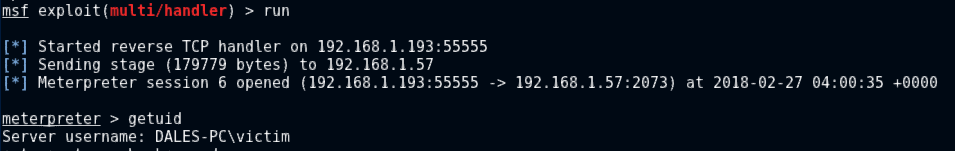
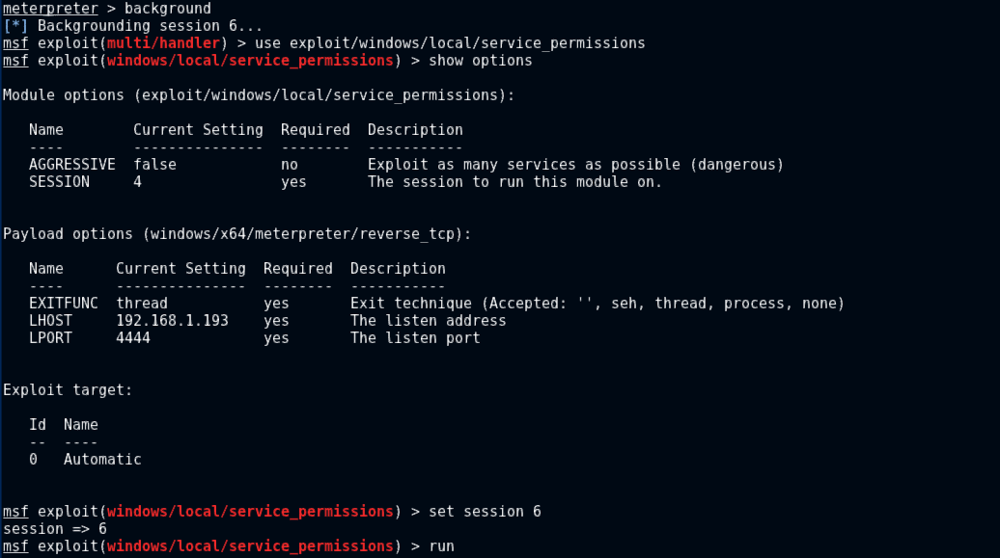
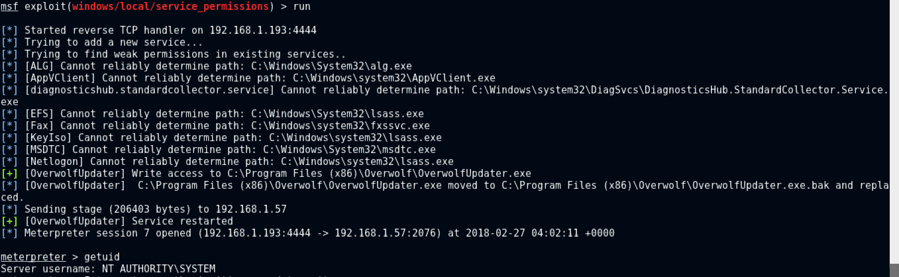

# Privilege escalation via Overwolf service

## Disclosure
* 15/12/2018 - Initial disclosure email sent to `support@overwolf.com`

## Summary 
The [Overwolf Platform](https://www.overwolf.com/), used to manage game related plugins, create a system service (`OverwolfUpdater`) with weak security permissions applied to the service binary that allows it to be modified, this would to allow an unprivilaged user to perform a privilage escalation attack. This can be used to attain system level access.

This is a privilege escalation exploit and would not initially compromise a host.

## Vulnerability Impact
* This attack would allow a malicious user to gain privileged access to a compromised host.
    * https://attack.mitre.org/techniques/T1058
    * https://attack.mitre.org/techniques/T1035
    * https://pentestlab.blog/2017/03/30/weak-service-permissions/
    * http://hackingandsecurity.blogspot.com/2017/07/windows-privilege-escalation-via-weak.html

* This is a local privilege escalation, and will not perform the initial compromise of a host. 

## Remediation
Service binaries and directories should be generated with appropriately secure security permissions to prevent malicious modification of the service binary.

## Proof Of Concept

This can be fairly trivally exploited with the metasploit framework.

Once initial compromise has taken place:

The live meterpreter session is detached and then the MSF exploit: `windows/local/service_permissions` is executed with a further meterpreter payload:

A system shell is then presented very shortly afterwards:

